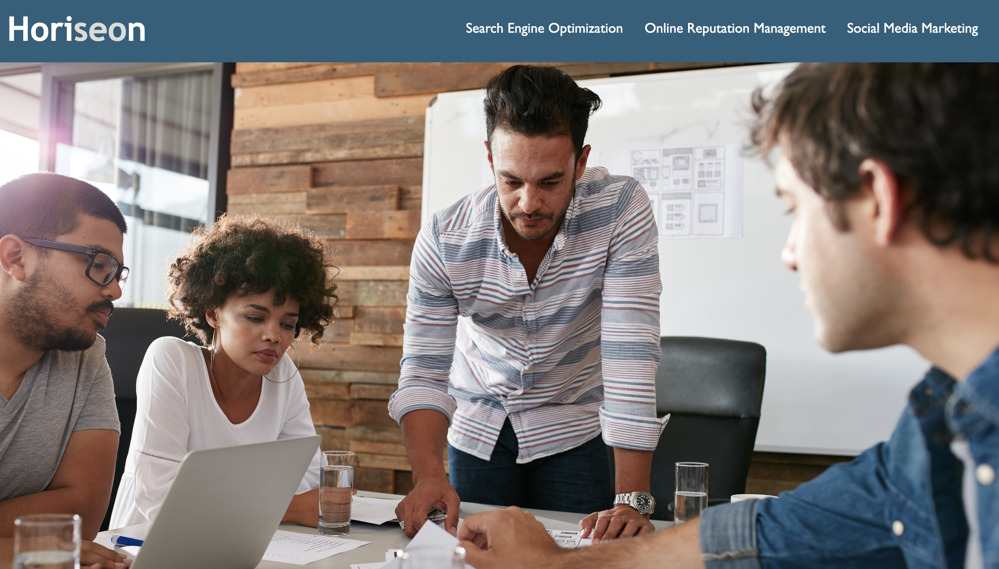
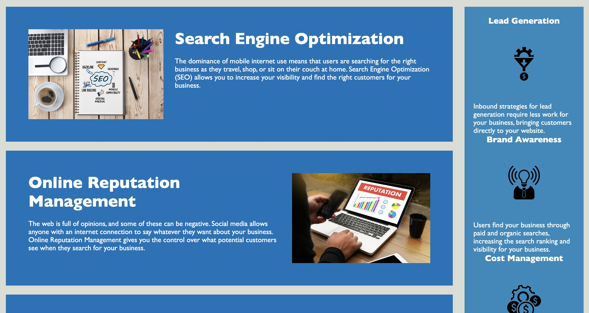

# challenge-week-1 Horiseon Marketing
This project was designed to create a search engine optimized and accessible marketing website.

## Table of Contents
-[About]
-[Getting-Started]
-[Contributing] 

## About
The goal of this project was to optimize the marketing agency's website for search engines and make sure it follows accessibility standards. I needed to make sure the html was structured properly and the sementic elements were correctly labeled. I added alt attributes to the images for accessibility. Also making sure the title element is concise and descriptive. 

## Getiing Started
Check out my portfolio and see my web developement skills!

## Contributing
Mary Christy